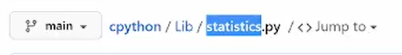
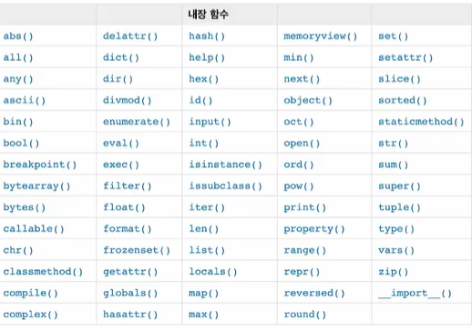
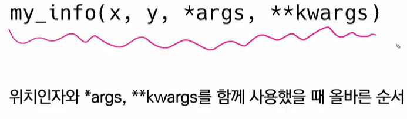
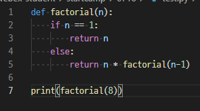

## 1. 함수

-모집단, 표준편차 같은 경우 for 조건문을 쓸 수 있지만 math나 statistics 같은 통계 함수를 import 해서 간단하게 구할 수도 있다.

-github에서 관련 내용을 밑의 경로에서 찾을 수 있음




-docstring:(Document String): 함수의 설명

-내장함수



-함수의 선언

 선언은 def 키워드를 활용함

 동작 후에 return을 통해 결과값을 전달함(반드시 하나의 객체를 반환)

```
ex) def cube(number):
		return number ** 3
```

```
ex) def foo(a, b)
		return a+b, a-b
	foo(1, 2)
	(3, -1)반환 #튜플 형식으로 반환, 함수는 반드시 하나의 객체를 반환
```

```
def greeting():
	print('hi')
이런 식이면 함수가 실행은 되지만 None 타입이 되어버림: return을 안 해서 그렇다!
```


## 2. 함수 input

-parameter: 매개변수 

- 함수에 입력으로 전달된 값을 받는 변수

-argument: (전달)인자, 인수

- 함수를 호출할 때 함수에 전달하는 입력 값, 즉 변수에 넣는 값

-기본 인자 값

- 기본값을 지정하여  함수 호출 시 인자 값을 설정하지 않도록 함

​      print에서 end = '' 안하면 자동으로 \n 되는거랑 같은 느낌

​      매개변수 정의할 때 쓰는거

-키워드 인자

- 인자를 넣을 때 add(x=2, y=5) 식으로 사용해서 딕셔너리처럼 만듬
- 

-가변 인자 리스트

- 매개변수 앞에 *를 붙여서 정의하면 임의의 개수 인자를 호출될 수 있게 하여 튜플로 묶어 처리함
- 매개변수는 '*args'로 하는게 관례임 

-가변 키워드 인자

- 딕셔너리로 묶어 처리, 매개변수에 **를 붙여 표현

*인자의 올바른 순서



위치인자 , 기본인자 , 가변 인자 리스트 , 가변 키워드 인자

## 3. 함수 Scope

-전역 스코프(global scope): 코드 어디에서든 참조할 수 있는 공간

전역 변수가 전역 스코프에 포함 됨

-지역 스코프(local scope): 함수가 만든 스코프. 함수 내부에서만 참조 가능 / 지역 변수가 지역 스코프에 포함 됨

-이름 검색 규칙

LEGB scope: Local(함수) -> Enclosed(특정 함수의 상위 함수) -> Global(함수 밖 변수, import 모듈) -> Built-in(내장함수)


-global 주의 사항: 함수 안에서 global 변수를 변경시키려  함

```
a = 10
def func1():
	global a
	a = 3
위 함수 호출시 global 변수였던 a가 3으로 변함
```

-nonlocal도 글로벌이랑 비슷한데 enclosed를 가져 옴

-nonlocal과 global의 차이: nonlocal은 선언된 적 없는 변수는 사용 불가,

global은 선언된 적 없는 변수도 가능

<global, nonlocal 변수 수정은 가급적 사용 않는 것을 권장>


-언패킹?? 

https://www.python.org/dev/peps/pep-3132/ 참고


## 4. 재귀함수



이런 식으로 스스로를 호출하여 도출하는 함수


## 5. 에러 

-syntax error: 문법 자체가 틀린 에러


-예외: 문법적으로는 올바르더라도 실행 중에 감지되는 에러

- ZeroDivisionError: 0으로 나눌 때
- NameError: namespace 상에 이름 없을 때, 선언한 적 없는 변수 부를 때?
- TypeError: 타입 불일치 ex) 1 + '1' , 

​     arqument(인자)에서 ,, 누락/ 개수 초과/ type 불일치

- ValueError: 타입은 올바르나 값이 적절하지 않거나 없는 경우
- IndexError: 인덱스가 존재하지 않거나 범위를 벗어나는 경우
- KeyError: 해당 키가 존재하지 않는 경우
- importError: 모듈은 있으나 클래스/함수가 존재하지 않을 때
- KeyboardInterrupt: 임의로 프로그램 종료할 때
- indentationError: 들여쓰기, 띄워쓰기 오류

## 6. 예외 처리

-try 문: 코드를 실행함/ except 절(:try 문에서 예외 발생시 실행)을 이용


- except도 if 문처럼 쭉 내려가는데 else가 없음, 그냥 뒤에 요인을 안 적으면 다 포함 됨

- except Exception << 가장 큰 범주의 오류라서 가장 마지막에 수행되어야 한다. 가장 작은 범주부터 순차적으로 예외 처리를 해야한다.

-else: try 문에서 예외가 발생하지 않으면 실행함

-finally: 예외 여부와 관계없이항상 실행함

-as:원본 에러 메시지를 사용할 수 있음

```
except IndexError as err:
	print(f'{err}, ')
결과: list index out of range
```


## 7. 예외 발생 시키기

-raise를 통해 강제로 발생 시킴

- raise <표현식>(메시지)

-assert: 디버깅 용도로 사용, 무조건 AssertionError가 발생

