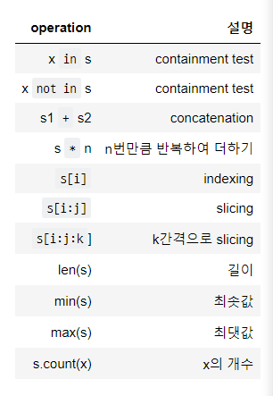
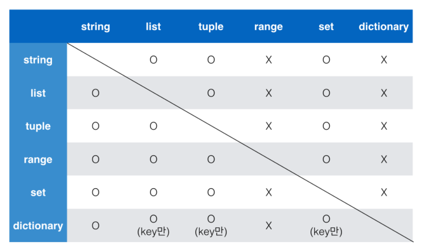

# 1. 시퀀스형 컨테이너

순서가 있어서 특정 위치의 데이터를 가리킬 수 있는 형태

ex) 리스트, 튜플, 레인지, 문자형(string)


### 1) 리스트

- [] 및 list()을 통해 만들 수 있다.

- 인덱스 접근이 가능

```
location = ['서울', '대전', '구미', '광주', '부울경']
print(location[0])
=> 서울
```


### 2) 튜플

- ()로 묶어서 표현
- 수정 불가능(immutable)하고 읽을 수밖에 없음
- x = 1,2 도 (1,2) 튜플이 됨
- 변수명을 하나만 넣은 튜플을 만들 때는 x  = (1,)처럼 콤마를 적어야 함

*시퀀스에서 활용할 수 있는 연산자/함수



```
my_list = [1,2,3,5,1]
print(my_list.count(2))
=>  1                 s.count(x)의 결과
```


-슬라이싱

```
print(location[1:3])
print(location[-4:-2])  #슬라이싱은 왼쪽에서 오른쪽으로만 가능
=>['대전', '구미']
['대전', '구미']
```


# 2. 비 시퀀스형 컨테이너

### 1) set

- 순서가 없고 중복값이 없다. ( 중복값 삭제할 때 용이할 듯)
- {}를 통해 만들고 수학에서의 집합과 동일하다
- 빈 세트를 만드려면 set()를 해야함({}불가능)
- |가 합집합, &가 교집합, -가 차집합


### 2) dictionary

- key와 value 한 쌍으로 이루어짐
- {}로 만든다. dict()로도 만들 수 있다.
- key는 immutable한 데이터만 가능(string, integer, float, boolean, tuple, range) * mutable한 데이터: list, dict, set
- value에는 list, dictionary 가능
- 중복된 key는 존재할 수가 없음
- .key()와 .values()와 .items() 메소드로 뽑아 낼 수 있다.

```
print(phone_book.keys())
=>dict_keys(['서울', '대전', '구미', '광주', '부울경'])
print(phone_book.values())
=>dict_values(['02', '042', '054', '061', '051'])
print(phone_book.items())
=>dict_items([('서울', '02'), ('대전', '042'), ('구미', '054'), ('광주', '061'), ('부울경', '051')])
```


-컨테이너형 형변환



-for 구문에서 dictionary가 리스트화 되어서 키만 나오는 듯