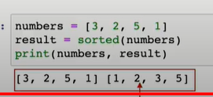
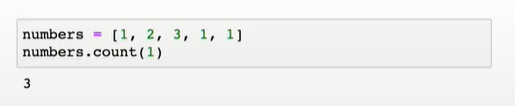
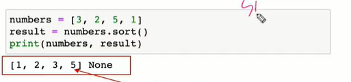

# 1. 내장함수

- abs(x) :  x의 절대값 또는 크기
- divmod(x, y) : 쌍 (x // y, x % y)
- round(값, 소수점자릿수): 소수점 자리까지 반올림 하는 함수
- int() 정수, float() 실수, complex(re, imag) 허수, str() 문자형
- sorted(리스트): 원본 리스트를 정렬함. 새로 만듬




# 2. 모듈

- math: isclose(a,b) -> 값이 가까운지
- datetime:

```
import datetime
today = datetime.datetime.now()
print(today)
print(f'오늘은 {today:%y}년 {today:%m}월 {today:%d}일 {today:%A}')
=> 오늘은 21년 07월 20일 Tuesday
```


## 3. method

리스트 관련

- .count(x): 원하는 값 x의 개수를 반환함



- .sort(): 원본 리스트를 정렬함. None 반환



-리스트 복사: 같은 리스트의 주소를 참조 원본과 복사본이 같이 변함.

그래서 얕은 복사를 하여 다른 주소를 참조하는 리스트를 만듬

- slicing 으로 새로운 리스트를 만듬
- list를 또 list()해서 새로운 리스트를 만듬

깊은 복사하는 방법도 있다

- copy.deepcopy(리스트)
