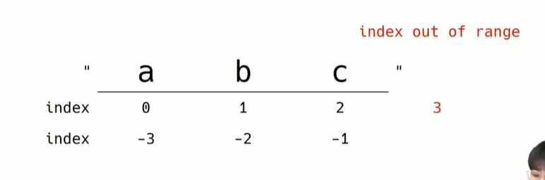
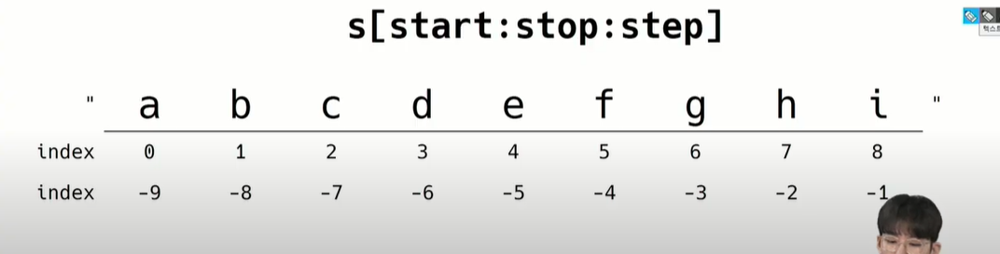

*문제열 인덱스

*slicing

*method

: .find(X) 같이 생긴거를 이제 method라고 부름

문자열.find(x): x의 첫번째 위치를 반환(첫번째로 있는 인덱스 번호), 없으면 -1

문자열.index(x): find와 같지만 x가 없으면 ValueError를 일으킨다.

*배커스 나우르 표기법:  [.]인데 선택 인자라는 뜻인 듯

*함수에 is~~가 들어가면 True, False로 답이 반환 된다.