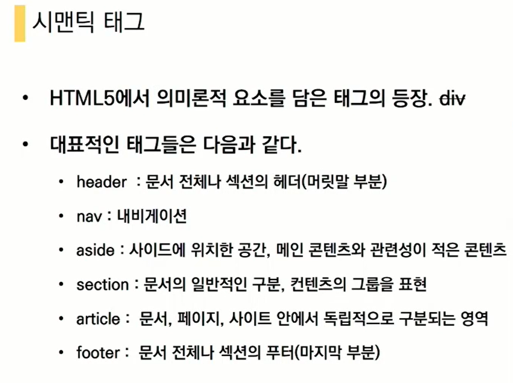
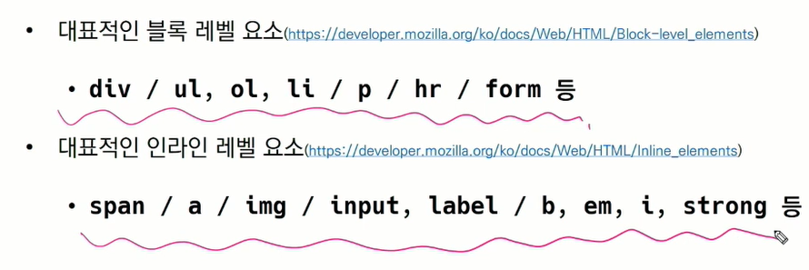
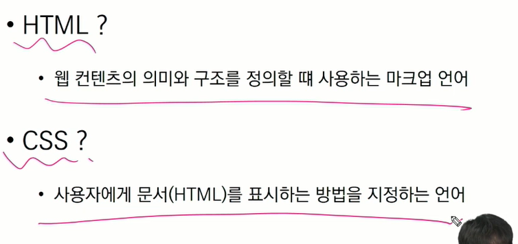

<시맨틱 태그>

<그룹 컨텐츠>

p: paragraph 문단을 뜻함
hr: 헤드라인을 그어줌
ol, ul: 리스트 혹은 숫자의 리스트  order list, unorder list

div: 텍스트를 그룹화

pre, blockquote

<텍스트 관련 요소 태그>

a: hyper text

b: 글씨를 굵게, 문자그대로 문자를 굵게

strong: 글씨를 굵게, 중요한 것이라 강조하며 실제로 의미가 있음. 시작장애인이 사용하는 '스크린 리더'를 사용할 때 b와 차이가 있음. 웹 접근성

i: 이태릭체

em: 이태릭체

span: div와 비슷함. div는 블럭요소고 span은 lnline요소만(텍스트 공간만 차지)

br: 파이썬의 \n과 같다

img: 이미지 태그

##### form tag: 

- action: 어디로 보낼지, 예를 들어 사이트나 이미지나 등등
- botton: 버튼
- input: 꼭 form 태그 안에 들어가야함 input 태그는 mdn 문서로 확인할 것!!!!!!!

class

submit: input의 타입이다. 제출하는 버튼이며 꼭  필요하다.

for: id와 연결하는 이름, 포탈 같은 것

### CSS

CSS 구문: 선택자와 선언(속성: 값)으로 이루어짐 / 중괄호 안에서 이루어짐

