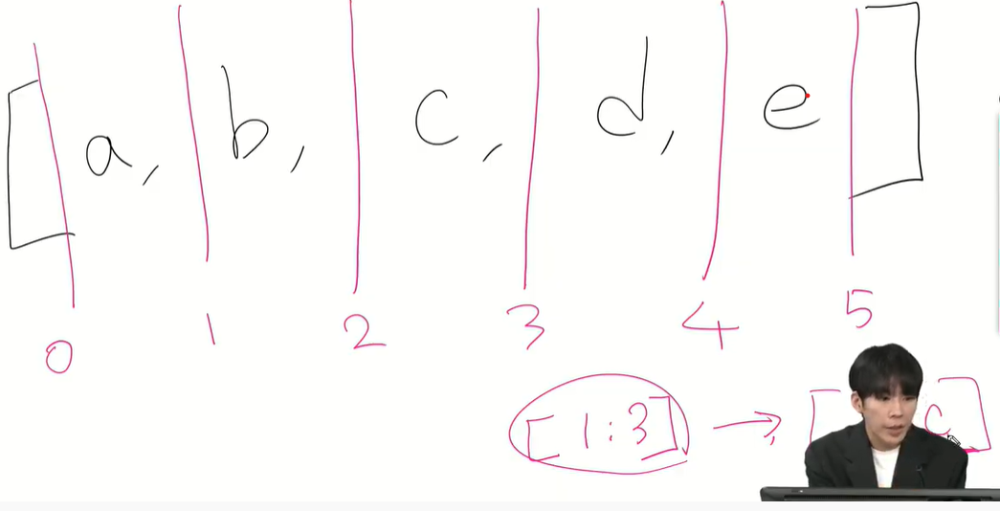
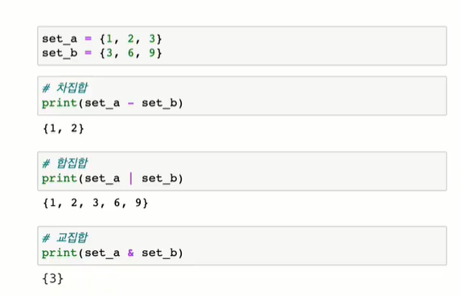
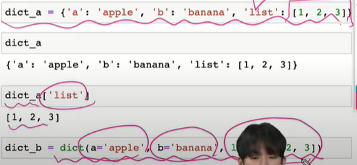
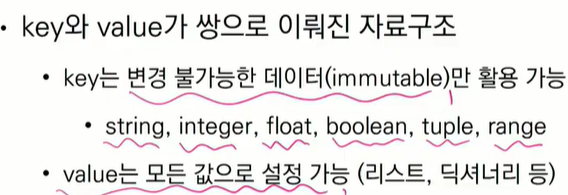
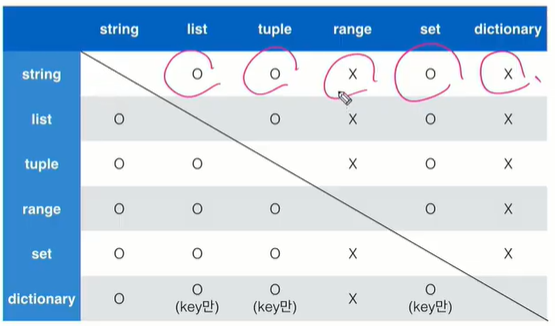
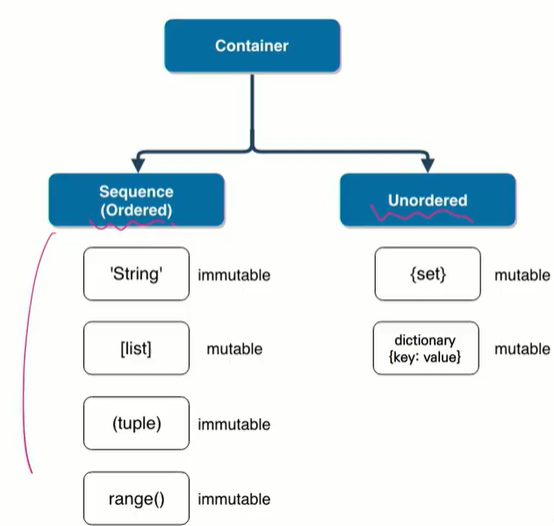
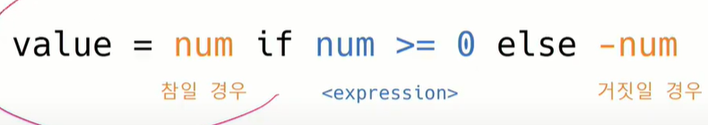
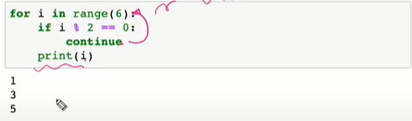
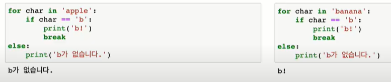

## 5. 표현식/ 문장

### 1) 문장 

-표현식, 식: 식별자, 값, 연산자로 구성

-표현식, 문장?

## 6. 컨테이너

### 1) 

- 여러 개의 값을 저장할 수 있는 것

- 순서가 있다 != 정렬되어 있다. 정렬: 오름차순 혹은 내림차순 등

- 시퀀스형: 순서가 있음 ex) list, tuple, range, string, binary

- 비 시퀀스: 순서가 없는 데이터 ex) set, dictionary

### 2)  리스트

- [1,2,3], list[1,2,3] 등으로 표현

- 값 접근 인덱스로 가능 ex) print(a[0]), 값 변경 가능 ex) a[0] ='1'처럼

- a = [[1,2],[3,5]] 에서 a[0] [1]은 2

### 3) 튜플

- 수정 불가능, 인덱스로 접근 가능

- (1, 2, 3, 1), tuple((1,2,3,1)) 등으로 표현

- 일반적으로 파이썬 내부에서 활용됨 /x, y = 1, 2 는 실제로 x, y =(1, 2)다

- 튜플, 리스트 차이?

- a = (1) => int // b = (1,) =>  tuple

### 4) 레인지(range)

-기본형: range(n) -> 0부터 n-1까지 숫자의 시퀀스

-범위 지정: range(n, m) -> n부터 m-1까지의 숫자 시퀀스

-범위 및 스텝 지정: range(n, m, s) -> n부터 m-1까지 s만큼 증가 시킴

 list(range(1,5,2)) => [1,3] // list(range(1,3,-1)), list(range(6,1,1)) => [] 

-형 변환 할 땐 list(range(4))로 표현 => [0,1,2,3]

-[1,2] +['a'] : [1,2,'a'] // (1,2) + ('a',): (1,2,'a')

-range(2) + range(2, 5) => 에러남, range끼리는 안 됨

-[0]*4: [0,0,0,0] // (1,2) * 2: (1,2,1,2) // range(1) * 3: error

### 5) 슬라이싱(slicing)

위 사진과 개념이 같음 근데 조금 헷갈림

### 6) 시퀀스

-길이: len()   ex)len([1,2,3]): 3

-최소/최대: min()/max()

-count: 시퀀스에서 특정 원소의 개수 // ex) [1,2,1,2,4].count(1): 2

## 7. 비시퀀스형

### 1) 세트

-중괄호({}) 혹은 set()를 통해 생성(빈 세트를 위해선 set()를 반드시 사용)

-중복된 값이 없음, 집합과 같은 구조를 가짐 ex) {1,2,3,1,2}: {1,2,3}

-순서가 없기에 인덱스가 없다

-밑에 사진이 집합 연산자

### 2) 딕셔너리

-key와 value가 쌍으로 이뤄진 자료구조

-중괄호({}) 혹은 dict()로 생성 

** 컨테이너 형 변환

-변경 가능한 데이터를 복사하면 2번째 데이터를 바꿀 때 1도 같이 바뀜

-컨데이너 분류 정리

## 8. 제어문

### 1) 제어문

### 2) 조건문

-중첩 조건 가능, if 안에 또 if 넣을 수 있음

-조건 표현식?

## 9. 반복문

### 1) while 문

-조건이 False가 될 때까지 반복한다.

-무한 루프를 하지 않도록 종료 조건이 필요

### 2) for 문

-시퀀스를 포함한 iterable한 객체 요소를 모두 순회함

-시퀀스를 쓸 때 복수형을 쓰는걸 추천 ex)char -> chars

-enumerate?

## 10. 반복문 제어

### 1) break

-break문을 만나면 반복문은 종료됨    // break만 치면 됨

### 2) continue

-conutinue 이후의 코드 블록은 수행 안 하고, 다음 반복 수행/ 아래와 같다

### 3)for ~ else~

### 4)pass 문

-할 일 없을 때 syntax에러가 안 나기 위해 자리를 채우는 용도, 곤약 같음

*git init 하기 전에 (master)가 붙여져 있는지 보고 한다.
