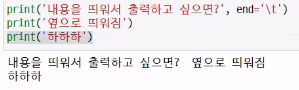
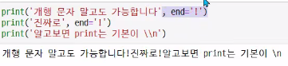
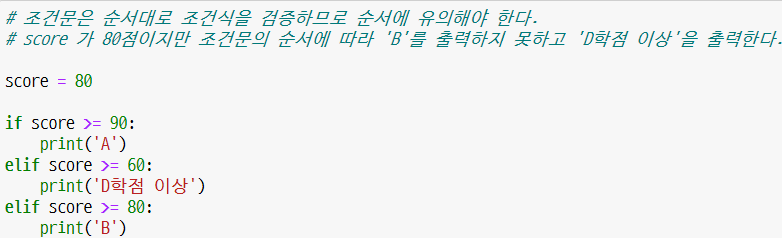

*input() -> string으로 취급

*문자열끼리의 마이너스는 없음

*lunch2 = [
    '짜장면', '짬뽕', '탕수육',
    '군만두', '물만두', '왕만두',
]

여기서 왕만두 뒤에 ','는 trail comma라고 실수를 줄이기 위해 찍음

*print를 변수로 넣었을 때 del print 하면 다시 오류 사라짐

*end 함수 사용 (아래 사진 참고)

*print(print(10))

-print 안에도 print가 가능하나 10이 도출되고 나면 None이 나옴

*표현식, 문장

-표현식은 값이 도출된다. 실행값이 값이다.

*슬라이싱은 왼쪽에서 오른쪽으로만 사용

*dictionary도 중복값이 적용 되지 않음

*조건문 작성할 때 순서가 중요함 (아래 사진 참고)

**while for 헷갈리는 부분 쥬피터 노트북 보고 공부하기

*while 조건 설정 할 때 주의점: while은 거짓이 될 때까지 돌리는 프로그램이다.

*enumerate

*내장함수- 함수명()요런 느낌

*sw 홈페이지에서 problem D2 정도 풀어보기