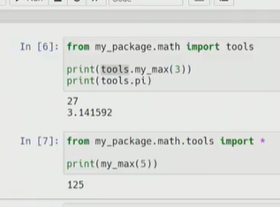
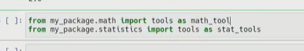
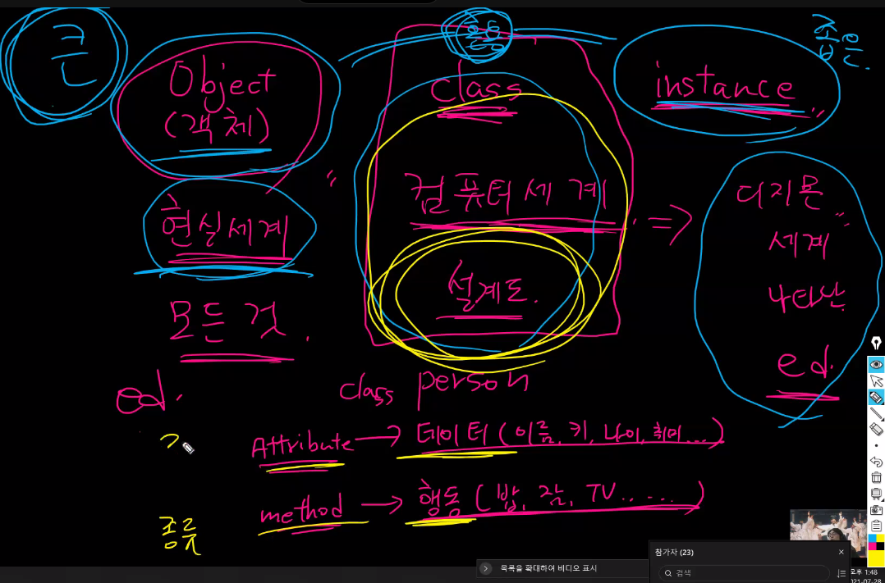

## 1. 모듈

pip list

:설치된 패키지들을 보여줌

pip freeze > requirments.txt

:설치된 패키지들을 문서로 저장해줌( requirements 이름은 관행적인 것.)

pip install -r requirements.txt

:문서에 있는 패키지들을 그대로 설치해줌

-보통 git hub의 대부분 프로젝트에서 requirements.txt를 같이 올려둠, 개발자의 조건을 가져야 프로그램을 사용할 수 있으므로

----------------------------------------------------------------------------------------------------------------

#### 가상환경

venv

- 가상 환경을 만들고 관리하는데 사용되는 모듈
- global에 영향을 받지 않는 서로 독립적인 환경이다.
- python -m venv 폴더명     (폴더명엔 관습적으로 venv를 사용)
- 가상환경 활성화(윈도우): soucrce venv/Scripts/activate
- 비활성화: deactivate
- venv 활성시에 venv 폴더 이외에 다른 폴더에서도 가상환경이 활성화 되어있음

which python

: 명령어를 사용하면 현재 활성화 된 파이썬 가상환경의 위치가 출력

-----------------------------------------------------------------------------------------------------------------

#### 모듈/패키지 활용하기

모듈 만들기

(1) ex) check.py 파일을 만들고, even(짝수 반환)과 odd(홀수 반환) 두 함수를 만든다.

(2) 다른 파일에서 import check를 하면 모듈 호출 가능

패키지 만들기

*언더바언더바int언더바언더바.py를 만들어 파일이 속한 폴더를 패키지로 인식

-아래 사진처럼 from 내부에서 얼마나 구체화하느냐에 따라 import 후 변수가 바뀜

-아래 사진처럼 import한 두 변수가 같을 때 변수명을 바꿀 수 있음

## 2. OOP

#### 객체

파이썬에 존재하는 모든 것은 객체로써 판별된다.

청사진은 '클래스' / 실제 집은 '객체'

Object, class, instance의 대략적 체계도 비유

#### 클래스(class)와 인스턴스(instance)

- 클래스 정의  class MyClass     (MyClass가 파스칼케이스?)

type: 메타클래스, class 밖의 범주이다. type의 클래스는 없다. type은 재귀함수처럼 돈다.

///  enumerate가 뭐지?  index와 index에 해당하는 요소가 같이 반환됨

*리스트 컴프리헨션 + 조건문 구문에서 참고 사항

단적인 조건문은 조건문이 뒤에 있어도 됨

조건 사항이 두개거나 분류를 해야하면 조건문이 앞에 있어야함

비유 요약: 뒤의 조건문은 거름망, 앞의 조건문은 분류박스

근데 연산 속도는 list comprehension이 for 구문보다 빠르다.

### 막간을 이용한 강의

==:

- 동등한(equal)
- 변수가 참조하는 객체가 동등한 경우 True

is:

- 동일한(identical)
- 두 변수가 동일한 객체를 가리키는 경우 True

## 보충수업

class는 공통 속성을 가진 여러 객체를 묶기 위해 사용한다.

