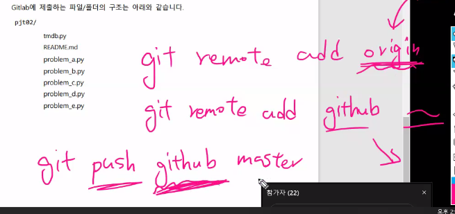

## PJT 02


Client는 URL을 통해 Server에게 Request를()

Server는 문서(텍스트)를 통해 Client에게 Response를

보낸다.


구글 네이버 등의 웹브라우저가 가장 유명한 client 프로그램이다.


##### requests

-웹 브라우저 안 쓰고 client 기능을 하기 위해 사용 

->requests를 pip에서 install

-HTML을 받아오는 것까지가 requests의 역할이다.

-원하는 대로 사용하기 위해 추가적인 작업이 필요하다.

->BeautifulSoup4를 pip에서 install

-크롤링의 단점

: 필요 없는 데이터가 너무 많음, 원하는 데이터를 얻기 위한 방법이 번거롭다.


### 오늘 PJT 설명

1. TMDB developer에서

api_key 발급후 원하는 api를 가져온다.

?api_key=f'{api_key}'

language=ko이라고 마지막에 쓰면 한국어로 번역되서 나옴


*get credits가 제작진 관련이다.


2. requests를 import해야 url에서의 정보를 가져올 수 있음

requests.get(request_url).json()으로 정보를 가져올 수 있다.

잘 정렬된 출력값을 보려면 pprint를 import해서 pprint로 출력하면 된다.


dictionary 특정 키를 가지고 정렬하기


```
함수 정의 시 ex) def __init__(self, x)  -> None: 이렇게 리턴값을 명시할 수 있다. 주석 같은 느낌이랄까
```


*git stash하면 이전 git의 형태로 돌이키는 컨트롤 + z 같은 것




git hub에도 동시에 올리기