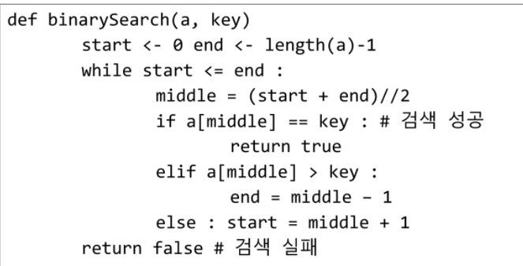

# 오늘의 공부 /210811 수요일

알고리즘 3일차, 월요일엔 1차 배열에 대해 배우고 오늘은 2차 배열에 대해 배웠다.

1차 배열은 월, 화 통해서 조금 익었기 때문에 오늘은 오늘 수업 내용 복습 및 파이썬 기본 복습을 할 것이다.


이때까지 내컴퓨터 TIL에만 저장해놓다가 처음으로 git hub에 push를 한다. 꾸준히 해보도록 하자.

## 1. 오늘 학습 이론 복습

### 2차원 배열

- 2차원 배열이란 기본적으로 행렬과 비슷하다

- n x m 또는 i x j, r x c 취향껏 하면 되는데 나는 잘 헷갈리지 않고 기억에 잘 남을 r(raw) x c(column)을 사용할 것이다.

- 행과 열을 어떻게 표시하냐? 그건 바로 2중 리스트를 이용하는 것이다. 예를 밑에 들겠다.

```
lst = []
for r in range(5):
    lst_small = []
    for c in range(5):
        lst_small.append(c)
    lst.append(lst_small)
print(lst)

>>
[[0, 1, 2, 3, 4], [0, 1, 2, 3, 4], [0, 1, 2, 3, 4], [0, 1, 2, 3, 4], [0, 1, 2, 3, 4]]

방금 급조했지만 이런식이다.
```

- 위 방식을 통해 idx를 조건에 맞게 바꾸면 행 순회, 열 순회, 지그재그 순회를 간단히 해낼 수 있다.


### 델타를 이용한 2차 배열 탐색

- 이 녀석은 처음 볼 때 신선하게 느껴지는 방식이다.
- dx dy(dr dc로 둬도 상관없다.)를 이용해서 

```
dr = [-1, 1, 0, 0]
dc = [0, 0, -1, 1]
를 r와 c에 더하여 인덱스를 옮기는 방식이다.
for r in range(5):
	for c in range(5):
		for i in range(4):
			nr = r + dr
			nc = c + dc
식으로 인덱스를 방향키처럼 조작할 수 있다.
```

- 이 때 주의할 점!! 인덱스 에러가 나지 않게 조건 울타리를 잘 설치해주어야한다.


##### 전치행렬

```
a[i][j] = > a[j][i] 로 바꾸는 것을 전치행렬이라한다.
```


### 부분집합 합

- 오늘 가장 헷갈렸던 녀석이다.

```
- 길이(N) 4를 가지는 lst = [1, 4, 2, 3]의 부분집합은 2의 N승이다.
- 각각 인덱스들이 가지는 경우의 수는 존재, 없음 총 2가지이다. 그렇기 때문    에 2*2*2*2 해서 2의 N승을 가진다.
그럼 부분집합을 어떻게 구하느냐?
위에 경우의 수를 구한 방식처럼 존재(1), 없음(0) 2진수를 사용한다.

방법은 2가지이다.

(1)
bit = [0, 0, 0, 0] N과 길이가 같은 빈 리스트를 만들고
for i in range(2):
	bit[0] = i
		for j in range(2):
			bit[1] = j
위와 같은 식으로 N개의 for문을 만드는 단순한 방법이 있다.
이 방법의 단점은 N을 input으로 받는다면 나로서 방법이 생각 안 난다는 것이다.


(2) 이 녀석이 이해하기가 제법 어려웠다.
N = 4
lst = [1, 4, 2, 3]
for i i in range(1<<N):
	for j in range(N):
		if i & (i<<j):
이 방법이다. 이 방법 설명은 기니까 박스 밖에 나가서 하겠다.
```

- (2) 번 방식은 비트연산자를 사용하는 방법이다. 
- 3<<1 = 6이다. 3이 110이니 110을 왼쪽으로 한 칸씩 밀면 1100이 되기 때문이다.
- & 연산자는 좌항 우항에서 겹치는 구간만 반환하는 연산자이다. ex) 101101 & 100101 = 100101이다. 이진수에서의 교집합을 구하는 연산자이다.

```
위 방법을 통해 
[0, 0, 0, 0] [0, 0, 0, 1] [0, 0, 1, 0] [0, 0, 1, 1]등 총 16가지의 모든 경우의 수를 만들 수 있고 이 리스트를 이중 리스트로 만들어서 원하는 값을 도출해낼 수 있다.
```


#### 검색

##### 순차 검색

정렬 안 된 자료, 정렬 된 자료에 따라 시간 소요가 다르다. 물론 정렬 된게 낫겠지? 너무 단순하니 패스


##### 이진 검색

- 예전에 숫자 야구 게임하던거 기억나지? 중간 찍고 업다운에 따라 반 자르고 다시 중간 집고 반자르고 하는 검색에서 내가 아는 가장 효율적인 방법이다.

- 이 것도 레인지나 인덱스를 어떻게 가지고 노냐에 따라 여러 방법이 있다. 뭐 결과는 비슷하지만 외우는 것보다 방식을 이해하는 게 도움이 될 거라 생각한다. 그래도 혹시 모르니 사진 첨부한다. 아래 사진은 수도코드로 만들어졌다.




#### 정렬

##### 선택 정렬

버블 정렬, 카운팅 정렬과 다르게, 대 또는 소 원하는 원소를 찾아 오름차순 혹은 내림차순으로 정렬하는 방식이다.


## 2) 오늘 연습문제 피드백

##### 선택 정렬

선택 정렬에서 원소 교환 방식은

```
lst[0][1], lst[1][0] = lst[1][0], lst[0][1] 식으로 간단히 한다.
```


##### 정말 자주 쓸거 같아서 외워야 할 듯한 리스트 입력 방식!

```
#lst = [1차원 리스트 먼저 만들고 얘를 몇개 만들지 ]
lst = [list(map(int, input().split())) for _ in range(N)] # N 개의 1차원 리스트가 만들어짐

위 문장식을 사용하면 이중 리스트가 입력에 맞춰서 나타난다.
```


##### 막간을 이용한 고찰

- 나중에 까먹을까봐 미리 말하는데, 나는 풀이 방식이 정말 극도로 'greedy' 하다. 풀기 전에 구상을 할 필요가 있다.

- i j r c nr 막 요런 변수들이 에러를 띄울 때가 있다. 급하게 하지말고 남 신경 쓰지말고 내 페이스대로 천천히 집중해서 하자.

- 이 부분은 너무 신경 쓸 필요는 없다

  속도를 빠르게 하기 위해선 필요없는 자료는 굳이 만들지 않아도 된다. 잡생각으로 가득 차서 불필요한 코딩은 안 해도 된다.

- 달팽이 문제 좀 어려웠다. 나중에 한 번 다시 풀어봐야한다.

#### 달팽이 숫자


- 위처럼 숫자 1을 더하는 등차수열을 밖에서 안으로 달팽이 껍질 같은 경로로 진행하는 문제이다.
- 교수님의 설명: 위 그림은 3X3이다. 교수님은 인덱스 오류를 피하기 위해선지 어떤 이윤지 모르겠지만
  1. 3X3 => 5X5로 만들어서 바깥 테두리를 다 -1로 표시하고
  2. 바깥 테두리가 닿으면 방향을 꺾는 방식을 설명하셨다. 물론 델타 탐색을 하였다(dr, dc)
  3. 교수님이 전제를 깔아줘서 매우 쉬웠지만 혼자 풀면 어떻게 될지 모르겠다.


##### 파이참 디버깅 단축키

toggle breakpoint: 브레이크포인트 토글 ctrl + F8

debug : 디버그 모드 진입 shift + F9 or alt + shift + f9

resume :  다음 브레이크 포인트 까지 실행 F9

step over :  한줄씩 실행 F8

step into : 함수 내부 진입 F7

step out :  함수 빠져나오기 shift + F8

stop: 디버깅 중지 ctrl + F2

run to cursor: 커서위치로 실행 옮기기 alt + F9


##### 파이참 꿀팁

컨트롤 알트 엘: 문자 띄워쓰기 정렬


*list2 교재 중 델타를 이용한 2차 배열 탐색 페이지 오타 있음

